# Telegram Ad Marketplace — Platform Documentation

> Final submission documentation covering architecture, engineering decisions, flows, key decisions, known limitations, and future roadmap.

---

## Table of Contents

1. [Architecture Overview](#1-architecture-overview)
2. [Channel Listing Flow](#2-channel-listing-flow)
3. [PR Manager System](#3-pr-manager-system)
4. [Campaign Model: Open vs Closed](#4-campaign-model-open-vs-closed)
5. [Unified Deal Flow](#5-unified-deal-flow)
6. [Creative Approval](#6-creative-approval)
7. [Scheduling & Auto-Posting](#7-scheduling--auto-posting)
8. [Monitoring Service](#8-monitoring-service)
9. [Escrow & Payment System](#9-escrow--payment-system)
10. [Payout & Refund](#10-payout--refund)
11. [Platform Fees](#11-platform-fees)
12. [Deal Timeouts](#12-deal-timeouts)
13. [User Role Flows](#13-user-role-flows)
14. [Partnerships View](#14-partnerships-view)
15. [Known Limitations](#15-known-limitations)
16. [Future Roadmap](#16-future-roadmap)

---

## 1. Architecture Overview

The platform is a **Telegram Mini App** built on the TON blockchain for trustless advertising deals.

| Layer | Technology | Purpose |
|-------|-----------|---------|
| Frontend | React + TypeScript + Vite | Telegram Mini App UI |
| Backend | Node.js + Hono + Grammy | REST API + Telegram Bot |
| Database | Supabase (PostgreSQL) | Data persistence |
| Blockchain | TON (native + USDT Jetton) | Escrow payments & payouts |
| Bot Framework | Grammy | Channel posting, monitoring, notifications |


---

## 2. Channel Listing Flow

### How It Works

A channel goes through a strict verification pipeline before it can appear on the marketplace.

```mermaid
flowchart TD
    A[Channel Owner enters channel username] --> B{Duplicate Check}
    B -->|Already listed| CONFLICT[409 Conflict: Already listed]
    B -->|Not listed| C{Bot Added?}
    C -->|No| STATE_A["State A: NOT_ADDED — Add bot as admin"]
    C -->|Yes| D{Bot is Admin?}
    D -->|No| STATE_B["State B: NOT_ADMIN — Promote bot to admin"]
    D -->|Yes| E{Required Permissions?}
    E -->|Missing| STATE_C["State C: MISSING_PERMS — Enable specific permissions"]
    E -->|All present| F{User is Creator?}
    F -->|No| NOT_OWNER["NOT_OWNER — Only channel creator can list"]
    F -->|Yes| G{Public Channel?}
    G -->|No username| PRIVATE["PRIVATE_CHANNEL — Only public channels allowed"]
    G -->|Has username| READY["State D: READY ✅"]
    READY --> H[Owner fills details: description, category, pricing, payout wallet]
    H --> I{Content Moderation}
    I -->|Blacklisted content| BLOCKED[400: Content Policy Violation]
    I -->|Clean| J[Channel saved as draft]
    J --> K[Owner publishes → status: active]
    K --> LISTED[Channel appears on marketplace]
```



### Key Engineering Decisions

1. **Bot Permission State Machine (`A → B → C → D`)**: Rather than a single pass/fail check, we implemented a 4-state machine that guides the user through each specific issue. The bot needs `can_post_messages`, `can_edit_messages`, and `can_delete_messages` — each checked individually with clear error messages.

2. **Owner-Only Listing**: Only the Telegram channel `creator` can list a channel. We enforce this via `getChatMember()` and checking `status === 'creator'`. PR managers and other admins cannot list channels — this is a security decision to prevent unauthorized listings.

3. **Duplicate Prevention**: Before the expensive Telegram API calls, we run a fast DB query checking `telegram_channel_id` uniqueness. Returns `409 Conflict` with the existing channel details.

4. **Private Channel Rejection**: Channels without a `username` (private channels) are blocked. Advertisers need to verify the channel exists and view it.

5. **Content Moderation on Entry**: All text fields (description, category, rate card titles/descriptions) are checked against a 250+ word blacklist before saving. This runs on both creation AND updates.

6. **Payout Wallet at Listing**: We ask for the channel owner's payout wallet during listing to ensure automatic payouts work after deal completion. If they skip it, they can connect their wallet later via TonConnect, and any `payout_pending` deals will auto-process.

7. **Channel Deletion Protection**: A channel cannot be deleted if it has active deals in any of 10 active states (`funded`, `draft_pending`, `draft_submitted`, `changes_requested`, `approved`, `scheduling`, `scheduled`, `posted`, `monitoring`, `in_progress`).

---

## 3. PR Manager System

### The Problem

Channel owners shouldn't need to manage every deal personally. They need to delegate operations while retaining control over finances and channel ownership.

### Our Decision

After evaluating several models, we decided:

- **Only channel owners can list a channel** — full control over what goes on the platform
- **After listing, owners can add PR managers** who can do everything except:
  - Receive payouts (only the owner's wallet gets paid)
  - Delete the channel from the platform
- PR managers can: manage deals, approve/reject drafts, negotiate scheduling, chat with advertisers

### How PR Managers Are Added

```mermaid
flowchart TD
    A[Owner opens channel settings] --> B[Selects 'Add PR Manager']
    B --> C{Fetch Telegram channel admins}
    C --> D[Show eligible admins — filter out bots and existing PR managers]
    D --> E[Owner selects admin to add]
    E --> F{Verify Telegram permissions}
    F -->|No admin permissions| FAIL["Must have at least one permission: post, edit, or delete"]
    F -->|Has permissions| G{User exists in DB?}
    G -->|No| H[Auto-create user record]
    G -->|Yes| I{Already admin in DB?}
    I -->|Yes| DUP["Already a PR manager"]
    I -->|No| J[Insert as pr_manager in channel_admins]
    J --> K[Notify PR manager via bot message]
```



### Permission Model

| Action | Owner | PR Manager |
|--------|:-----:|:----------:|
| List channel | ✅ | ❌ |
| Edit channel details | ✅ | ✅ |
| Manage deals | ✅ | ✅ |
| Approve/reject drafts | ✅ | ✅ |
| Negotiate scheduling | ✅ | ✅ |
| Chat with advertisers | ✅ | ✅ |
| Receive payouts | ✅ | ❌ |
| Delete channel | ✅ | ❌ |
| Remove PR managers | ✅ | ❌ |

### Key Engineering Decision

The benefit of this model is that **channel owners can step away from operations entirely** and just receive their payouts after every completed deal. PR managers handle the day-to-day negotiations, scheduling, and content coordination.

### Team Verification

Before any channel update, we verify ALL team members (bot, owner, every PR manager) still have valid Telegram admin permissions. If any member has lost permissions, the update is blocked with a detailed per-member error list. This prevents stale permissions from causing posting failures.

When admin permissions are synced, PR managers who are no longer admin on Telegram are automatically cleaned up from the database.

---

## 4. Campaign Model: Open vs Closed

We implemented two campaign types to serve different advertiser needs.

### Open Campaign

**Use case**: "I have a budget and criteria — any matching channel can run my ad."

- Advertiser sets eligibility criteria: subscriber range, language, category, minimum avg views
- Any channel meeting the criteria can **apply and immediately enter the deal flow** (→ draft creation)
- No advertiser review of applications — if you meet the criteria, you're in
- Slots are allocated atomically (DB-level) to prevent race conditions
- When all slots are filled, campaign is marked as `filled`

### Closed Campaign

**Use case**: "I want to review which channels will run my ad before committing."

- Same criteria as open campaigns
- Channels that meet criteria can **apply**, but there's an extra step
- Applications go to a `pending` state — the advertiser reviews each channel's profile
- Advertiser can **approve or reject** each application
- Only approved channels enter the deal flow
- This gives advertisers control over brand alignment, audience quality, etc.

### Why Both Models?

Some advertisers just want reach: set criteria, fund it, and let matching channels pick it up. Others care deeply about which specific channels represent their brand. The dual model serves both without forcing a one-size-fits-all approach.

### Campaign Lifecycle


---

## 5. Unified Deal Flow

All three entry points — **Open Campaign**, **Closed Campaign**, and **Service Packages** — converge into a single unified deal pipeline.

### Three Entry Points, One Pipeline

```mermaid
flowchart TD
    subgraph "Entry Points"
        OP[Open Campaign<br/>Channel meets criteria → auto-accepted]
        CL[Closed Campaign<br/>Channel applies → advertiser reviews → approved]
        SP[Service Packages<br/>Advertiser browses channel → picks package → pays]
    end

    OP --> FUNDED
    CL --> FUNDED
    SP --> FUNDED

    subgraph "Unified Deal Pipeline"
        FUNDED[funded<br/>💰 Escrow received]
        FUNDED --> DP[draft_pending<br/>✏️ Channel owner creates draft]
        DP --> DS[draft_submitted<br/>📤 Sent to advertiser for review]
        DS --> |Approved| SCHED[scheduling<br/>⏰ Negotiate posting time]
        DS --> |Changes requested| CR[changes_requested<br/>💬 Feedback sent to channel]
        CR --> DS
        SCHED --> SCHEDULED[scheduled<br/>📅 Time agreed, auto-post queued]
        SCHEDULED --> POSTED[posted<br/>📢 Live on channel]
        POSTED --> MONITORING[monitoring<br/>👁️ 24h verification checks]
        MONITORING --> |Post stays up| RELEASED[released<br/>✅ Funds paid to channel owner]
        MONITORING --> |Post deleted| CANCELLED[cancelled<br/>❌ Refund to advertiser]
    end

    subgraph "Terminal States"
        RELEASED
        CANCELLED
        REFUNDED[refunded<br/>↩️ Funds returned]
        FAILED[failed_to_post<br/>⚠️ Bot couldn't post]
    end
```



> [!IMPORTANT]
> Regardless of how a deal enters the pipeline, every deal goes through the same draft → review → schedule → post → monitor → release flow. This is a key architectural decision — it means security checks, monitoring, and payment logic only need to be implemented once.

### Service Packages

Service packages are the simplest entry point. An advertiser browses listed channels, views their rate card (package offerings), picks a package, and pays. The deal is created with the package details as content items.

> [!NOTE]
> Currently, only **Posting** works for service packages. **Story** posting requires MTProto client integration (covered in [Limitations](#15-known-limitations)).

---

## 6. Creative Approval

### The Draft → Review → Feedback Loop

All content goes through a creative approval process before posting. This happens entirely through the Telegram bot — no webapp interface needed.

```mermaid
sequenceDiagram
    participant CO as Channel Owner/PR Manager
    participant Bot as Telegram Bot
    participant DB as Database
    participant AD as Advertiser

    Note over CO,AD: Deal reaches 'funded' status

    Bot->>CO: 📝 "New deal! Create your draft"<br/>(deep link: /start draft_{dealId})
    CO->>Bot: Sends text or photo draft
    Bot->>DB: Save draft content
    Bot->>CO: "Preview your draft" + Submit/Edit buttons
    CO->>Bot: Clicks "Submit Draft ✅"
    Bot->>DB: Status → draft_submitted
    Bot->>AD: 📋 "Review this draft" + Approve/Request Changes buttons

    alt Advertiser Approves
        AD->>Bot: Clicks "Approve ✅"
        Bot->>DB: Status → scheduling
        Bot->>AD: Shows scheduling UI immediately
        Bot->>CO: "Draft approved! Waiting for scheduling"
    else Advertiser Requests Changes
        AD->>Bot: Clicks "Request Changes 📝"
        Bot->>AD: "What changes do you need?"
        AD->>Bot: Types feedback
        Bot->>DB: Save feedback, status → changes_requested
        Bot->>CO: "Changes requested: [feedback]"
        Note over CO: Can also chat directly with<br/>advertiser through bot
        CO->>Bot: Sends revised draft
        Note over CO,AD: Loop repeats
    end
```



### Key Implementation Details

1. **Context-Based Routing**: When a user sends a text message to the bot, we check the `user_contexts` table to route it correctly — `draft` context saves draft content, `chat` context forwards to the other party, `feedback` context saves advertiser feedback.

2. **Race Condition Prevention on Submit**: We use conditional UPDATE queries — `.in('status', ['draft_pending', 'changes_requested'])` — so if two PR managers try to submit the same draft simultaneously, only one succeeds.

3. **Multi-Admin Notifications**: All notifications go to ALL channel admins (owner + every PR manager), not just the one who acted. This keeps the entire team informed.

4. **Photo/Text Handling**: The bot detects whether a draft is text or photo (with caption). When editing messages, it uses `editMessageCaption` for photo/video messages and `editMessageText` for text-only messages, with a fallback to `ctx.reply()` if either fails.

5. **Highest Quality Photo**: When receiving photos, we take `photo[photo.length - 1]` — Telegram provides photos in ascending size order, so the last element is always the highest quality.

6. **12h Auto-Approve**: If the advertiser doesn't review a submitted draft within 12 hours, it's automatically approved and moves to scheduling. This prevents deals from stalling indefinitely.

### In-Bot Chat System

Both parties can communicate directly through the bot at any point during the draft process:

- **Advertiser → Channel**: Messages are sent to ALL channel admins (owner + PR managers)
- **Channel Admin → Advertiser**: Messages are sent to the advertiser
- Messages are stored in a `deal_messages` table with sender role and timestamp
- If notification delivery fails, the message is still saved — data integrity over delivery guarantee

---

## 7. Scheduling & Auto-Posting

### Time Negotiation

After the advertiser approves a draft, they're immediately shown the scheduling interface.

```mermaid
sequenceDiagram
    participant AD as Advertiser
    participant SYS as System
    participant CO as Channel Owner

    AD->>SYS: Proposes time (1h – 30 days ahead)
    SYS->>CO: ⏰ "Advertiser wants to post at [time]"

    alt Channel Accepts
        CO->>SYS: Accepts proposed time
        SYS->>AD: ✅ "Time confirmed! Auto-posting at [time]"
        SYS->>CO: ✅ "Time confirmed!"
        Note over SYS: Status → scheduled
    else Channel Counter-Proposes
        CO->>SYS: Proposes different time
        SYS->>AD: ⏰ "Counter proposal: [new time]"
        Note over AD,CO: Negotiation continues until<br/>one side accepts
    end
```



### Engineering Details

- **Optimistic Locking**: Time acceptance uses `.is('agreed_post_time', null)` — if two admins try to accept simultaneously, only the first succeeds
- **24h Auto-Accept Timeout**: If a proposed time gets no response within 24 hours, it's automatically accepted
- **Scheduling Window**: Posts can be scheduled 1 hour to 30 days ahead
- **Timezone**: Times are displayed in WAT (UTC+1) for the user's locale

### Auto-Posting

A background job checks every minute for deals where `status = 'scheduled'` and `agreed_post_time ≤ now`. When it finds one:

1. **Re-verify bot permissions** — confirms bot is still admin with `can_post_messages`
2. **Post to channel** — text or photo with caption
3. **Start monitoring** — generate random check times
4. **Notify both parties** — "Post is live!"

If posting fails:

1. Set status to `failed_to_post` (atomic guard prevents double-processing)
2. Queue refund to advertiser
3. Release the campaign slot
4. Demote channel to `draft` (requires re-verification before listing again)
5. Notify both parties

---

## 8. Monitoring Service

### Anti-Gaming Architecture

The monitoring service is designed to prevent channel owners from gaming the system — for example, posting the ad, then deleting it and reposting just before a check.

#### Time-Band Algorithm

Instead of predictable check times (1h, 6h, 12h, 24h), we use **random checks within time bands**:

```
Formula: numBands = ceil(monitoringDuration / 3)
Each band = duration / numBands hours wide
One random check per band + 1 final check at the end

Examples:
  6h monitoring  → 2 bands of 3h  → 2 random + 1 final = 3 checks
  24h monitoring → 8 bands of 3h  → 8 random + 1 final = 9 checks
```

```
24h Monitoring — Random Check Distribution (Example)

Band 1  [0h ─────── 3h]    ✓ Check at ~1:47
Band 2  [3h ─────── 6h]    ✓ Check at ~4:22
Band 3  [6h ─────── 9h]    ✓ Check at ~7:51
Band 4  [9h ──────12h]     ✓ Check at ~10:33
Band 5  [12h ─────15h]     ✓ Check at ~13:08
Band 6  [15h ─────18h]     ✓ Check at ~16:45
Band 7  [18h ─────21h]     ✓ Check at ~19:12
Band 8  [21h ─────24h]     ✓ Check at ~22:39
Final   [────────24h]      ✓ Final check at exactly 24:00

Total: 9 checks, all at unpredictable times
```

Each random check is placed with a **5-minute buffer** from band edges (or 10% of band width if smaller) to prevent clustering at boundaries. If the band is too small for the buffer, we use the midpoint.

> [!IMPORTANT]
> **Why random?** If checks were at predictable times (every 3 hours), a channel owner could delete the ad immediately after a check, keep it deleted for ~2.5 hours, then repost it 5 minutes before the next check. Random timing within bands makes this strategy impossible — you never know when the next check is coming.

### How We Verify a Post Is Still Live

**Primary Method — `forwardMessage` to a private verification channel:**

We forward the post to a private channel that only the bot has access to. If the forward succeeds, the post exists. If it fails with "message to forward not found" or "MESSAGE_ID_INVALID", the post was deleted.

**Why `forwardMessage` instead of `copyMessage`?**

We initially used `copyMessage` (copy to same channel → immediately delete the copy). The problem: every `copyMessage` call sends a notification to the channel owner/subscribers, even though we delete the copy within milliseconds. With 8-9 checks over 24 hours, this caused **notification spam**. `forwardMessage` to a private verification channel solves this entirely — no notifications, no visible traces.

**Fallback — `copyMessage`:**

If the verification channel is inaccessible (misconfigured, bot removed), we fall back to `copyMessage`. This is the less-ideal method but ensures monitoring doesn't break entirely.

### Error Classification

The monitoring service carefully classifies errors to avoid false positives:

| Error Type | Meaning | Action |
|-----------|---------|--------|
| `message to forward not found` | Post was actually deleted | Cancel deal + refund |
| `MESSAGE_ID_INVALID` | Post was deleted | Cancel deal + refund |
| `chat not found` / `CHAT_WRITE_FORBIDDEN` | Verification channel issue | Fallback to `copyMessage` |
| `bot was kicked` (403) | Bot removed from source channel | Cancel deal + refund |
| Unknown error | Unexpected issue | Flag for support, don't assume deleted |

### Edited Message Detection

`forwardMessage` forwards the **original** message content. If a channel owner edits the post (e.g., removes the ad content), the forwarded version in the verification channel shows the current state. We can compare the verification channel's forwarded content against the approved draft to detect unauthorized edits.

### Post Deleted During Monitoring

If a post is verified as deleted during any check, the deal is immediately cancelled and the advertiser receives a refund. Both parties are notified.

---

## 9. Escrow & Payment System

### Master Wallet Architecture

> [!IMPORTANT]
> **Key Decision**: We use a **single master wallet** for all escrow deposits instead of generating per-deal wallets.

**Why?** Per-deal wallets would create hundreds of wallets with small balances — "dust" that's expensive to consolidate. A single master wallet means:
- One wallet to secure
- One wallet to monitor
- Efficient fund management
- Lower operational overhead

### How We Track Payments — Memo System

Every deal/campaign generates a unique payment memo:

- **Deals**: `deal_<uuid16>` (e.g., `deal_a3b4c5d6e7f8g9h0`)
- **Campaigns**: `campaign_<uuid16>` (e.g., `campaign_x1y2z3w4v5u6t7s8`)

When the advertiser pays, they include this memo as a comment in their TON transaction. The system matches incoming transactions to deals/campaigns by this memo.

### Where We Escrow

All funds are held in the **platform's master wallet** on the TON blockchain. The escrow is:

- **Funded** when the advertiser sends payment with the correct memo
- **Held** throughout the deal lifecycle (draft → approval → posting → monitoring)
- **Released** to the channel owner after successful 24h monitoring
- **Refunded** to the advertiser if the deal is rejected, cancelled, or times out

### Hybrid Payment Detection: Webhook + Polling

We use a **creative hybrid approach** to ensure no payment is ever missed:


**Webhook (Primary)**: TonAPI sends real-time `account-tx` notifications when our wallet receives a transaction. We fetch full transaction details, extract the memo, and process the payment.

**Polling (Backup)**: A service polls TonCenter API every 30 seconds, checking for new transactions. TON and Jetton (USDT) polls are **staggered by 15 seconds** to avoid rate limits (429 errors).

**Why both?**
- Webhooks can fail (network issues, TonAPI downtime)
- Polling can be slow (30-second gap)
- Together, they provide near-instant detection with guaranteed eventual processing

### Idempotency

Payments are protected against double-processing at multiple levels:

1. **In-memory Set** — tracks processed transaction hashes (max 1000 entries, FIFO eviction)
2. **DB-backed check** — verifies `escrowTxHash` or `escrowDeposited > 0` before processing
3. **Mutex for campaigns** — `processingCampaigns` Set prevents parallel processing of the same memo

### Dual Currency Support

Both native **TON** and **USDT (Jetton)** are supported:

| Aspect | TON | USDT |
|--------|-----|------|
| Decimals | 9 (`/1e9`) | 6 (`/1e6`) |
| Transfer type | Native | Jetton (`op: 0xf8a7ea5`) |
| Memo extraction | `decoded_body.text` | `forward_payload.text` |
| Platform fee | 0.01 TON | 0.1 USDT |
| Gas for payout | ~0.01 TON | ~0.05 TON |

### Address Normalization

TON addresses come in multiple formats (raw, bounceable, non-bounceable). We use `@ton/core Address.parse().equals()` for all comparisons to handle format differences correctly.

### Payment Window

Every payment has a **15-minute expiry window**. If payment doesn't arrive within 15 minutes, the deal/campaign is not automatically cancelled (the user already committed), but the expiry is logged for audit purposes.

---

## 10. Payout & Refund

### Automatic Payouts

After successful 24h monitoring, the system automatically pays the channel owner.

**Wallet Resolution Cascade (3-tier):**

1. Channel's `payout_wallet` (set during listing)
2. Deal's `channel_owner_wallet` (stored at deal creation)
3. Owner's TonConnect `ton_wallet_address` (from user profile)

If no wallet is found at any tier, the deal enters `payout_pending` status (NOT `released` — the DB stays honest that money hasn't moved).

### Payout-Pending Recovery

When a channel owner later connects their TonConnect wallet:

1. Wallet auto-saved to their user profile
2. All owned channels without a payout wallet get updated
3. All `payout_pending` deals on their channels are **immediately processed** — payouts are queued and executed

This means owners can list a channel without a wallet, run deals, and connect their wallet later — nothing is lost.

### Auto-Approve Threshold

- Payouts ≤ 5 TON/USDT: **auto-executed immediately**
- Payouts > 5 TON/USDT: require admin approval (`pending_approval` status)

### Retry Logic

Failed payouts retry up to **3 times** with incrementing `retry_count`. Each attempt is logged.

### Refund Flow

Refunds are triggered in these scenarios:

| Trigger | When |
|---------|------|
| Channel rejects deal | Advertiser gets full refund |
| Draft times out (12h) | Channel never created draft |
| Deal times out (48h) | No activity from channel |
| Post deleted during monitoring | Advertiser gets refund |
| Campaign ended (unfilled slots) | `slots_remaining × perChannelBudget` refunded |
| Post failed to publish | Bot couldn't post → full refund |

**Refund wallet resolution**: Uses the stored `escrow_wallet_address`. If not stored, looks up the original sender from the escrow TX hash via TonAPI and caches the address for future use.

If refund queueing fails, the deal goes to `pending_refund` status for manual intervention — we never silently lose money.

### Campaign Refund for Unfilled Slots

When a campaign ends (manually or via expiry), only unfilled slots are refunded:

```
refundAmount = (totalSlots - slotsFilled) × perChannelBudget
```

Active deals continue running — the refund only covers slots that were never used.

---

## 11. Platform Fees

We charge a **flat platform fee** on every payment:

| Currency | Fee | Rationale |
|----------|-----|-----------|
| TON | 0.01 TON | Covers network gas for sending, releasing, and refunding transactions |
| USDT | 0.1 USDT | Jetton transfers cost ~0.05 TON in gas, so a higher fee covers the overhead |

**Why flat instead of percentage?**

Flat fees are more transparent and predictable. A percentage fee would disproportionately affect smaller deals. The fee is just enough to cover blockchain transaction costs so the platform doesn't lose money on gas.

**Precision handling**: Total is calculated with `Math.round((budget + fee) × 1e9) / 1e9` to avoid floating-point precision errors in financial calculations.

---

## 12. Deal Timeouts

Every stage in the deal flow has a timeout to prevent deals from stalling indefinitely:

```mermaid
flowchart TD
    F[funded] -->|48h no response| R1[Auto-refund to advertiser]
    DP[draft_pending] -->|12h no draft created| R2[Auto-refund to advertiser]
    DS[draft_submitted] -->|12h no review| AA[Auto-approve → scheduling]
    SCH[scheduling] -->|24h no counter| AT[Auto-accept proposed time]
    EXP[Campaign expired] -->|24h grace period| END[Auto-end + refund unfilled slots]
```



| Stage | Timeout | Action |
|-------|---------|--------|
| `funded` → no response | 48 hours | Auto-refund to advertiser |
| `draft_pending` → no draft | 12 hours | Auto-refund to advertiser |
| `draft_submitted` → no review | 12 hours | Auto-approve draft → scheduling |
| `scheduling` → no counter | 24 hours | Auto-accept proposed time |
| Campaign expired | 24h grace | Auto-end + refund unfilled slots |
| Payment window | 15 minutes | Logged (payment still accepted) |

> [!NOTE]
> **Campaign expiry** has a special 24-hour grace period. When a campaign expires, the advertiser is notified and given 24 hours to extend the duration. If they don't extend, the campaign auto-ends and unfilled slots are refunded. An `expiry_notified` flag prevents duplicate notifications.

---

## 13. User Role Flows

### What an Advertiser Can Do

1. **Create campaigns** (open or closed) with targeting criteria
2. **Browse channels** on the marketplace
3. **Buy service packages** directly from channel listings
4. **Review applications** (closed campaigns)
5. **Review draft posts** and provide feedback
6. **Schedule posting times** (1h – 30 days ahead)
7. **Chat with channel owners** through the bot
8. **End campaigns** early (unfilled slots refunded)
9. **Edit campaign** duration
10. **Rate channels** after deal completion (1-5 stars)

### What a Channel Owner Can Do

1. **List channels** with verification pipeline
2. **Set pricing** via rate card (service packages)
3. **Add/remove PR managers** for delegation
4. **Browse campaigns** on the marketplace
5. **Apply to campaigns** (if channel meets criteria)
6. **Create draft posts** through the bot
7. **Negotiate scheduling** (accept or counter-propose times)
8. **Chat with advertisers** through the bot
9. **Rate advertisers** after deal completion
10. **Connect wallet** for payouts (can be done anytime)

### What a PR Manager Can Do

Everything a channel owner can do **except**:
- ❌ Receive payouts
- ❌ Delete the channel
- ❌ Add/remove other PR managers

---

## 14. Partnerships View

Both sides have a **Partnerships** tab showing their active and historical deals:

**Advertiser's Partnerships**: All deals they've funded, grouped by status. Shows channel details, deal progress, and action buttons (review draft, schedule time, rate).

**Channel Owner's Partnerships**: All deals on their channels, including deals managed by their PR managers. Shows advertiser details, deal progress, and action buttons (create draft, accept/counter time, rate).

Both views use the same underlying deal data but present it from each party's perspective with role-appropriate actions.

---

## 15. Known Limitations

### Story Posting

> [!WARNING]
> **Story posting is not supported.** The Telegram Bot API does not allow bots to post stories, view stories, or edit stories. Story functionality can only be implemented with the **MTProto client**, which requires significant additional security infrastructure (user sessions, 2FA handling, rate limit management). This is a planned future enhancement.

Currently, only **posting** (text and photo posts to channels) is functional.

### Channel Stats

Telegram's Bot API provides limited channel statistics:
- Member count (subscribers)
- Basic channel info (title, username, photo)

Advanced analytics (engagement rates, views per post, audience demographics, language distribution) require the **MTProto client** and the `stats.GetBroadcastStats` API. We have a `TelegramStatsService` with MTProto integration prepared, but it currently falls back to mock data when API credentials aren't configured. Full MTProto integration requires additional security considerations around API key management and session handling.

### Content Moderation Bypass

The current blacklist (250+ words across 10 categories) can be bypassed with creative spelling, Unicode substitutions, or obfuscation. Future versions will implement more sophisticated NLP-based content moderation, including in the chat system.

---

## 16. Future Roadmap

### Near-Term Enhancements

**Bidding System for Channel Listings**
Advertisers will be able to bid slightly below a channel's listed service package price. The channel owner can accept or decline. After the third bid, the advertiser cannot bid again — this prevents spam while still enabling price negotiation.

**PR Manager Financial Permissions**
Channel owners will be able to grant financial permissions to specific PR managers, allowing them to set their own payout wallet and receive payouts directly. The owner controls this on a per-manager basis.

**Campaign Scheduling**
Campaigns will be schedulable to go live at a specific future time, allowing advertisers to plan campaigns in advance.

**Channel Invitations**
Advertisers will be able to invite specific channels to their campaigns. Invitations will be sent to channel owners/PR managers. This will likely be limited to channels already listed on the platform.

### Advanced Analytics (MTProto)

Full MTProto integration will unlock:

- **Audience demographics**: Language distribution, geographic data
- **Engagement metrics**: Views per post, forwards, reactions
- **Advanced targeting**: More specific campaign criteria based on real channel analytics
- **Post-campaign reporting**: Actual performance metrics for completed ads

> [!IMPORTANT]
> MTProto integration requires significant security infrastructure: secure session storage, API credential management, rate limiting (Telegram aggressively rate-limits MTProto), and proper error handling for session invalidation. This is non-trivial and will be a dedicated engineering effort.

### Support System

We plan to use the **private verification channel** as a support system. Since every monitored post is forwarded to this channel, support staff can use a deal ID to trace exactly what happened:

- Was the post actually published?
- Was it deleted during monitoring?
- What did the approved draft look like?

This provides an audit trail for dispute resolution without building additional infrastructure.

### Stricter Content Moderation

The blacklist will be significantly expanded with:
- NLP-based detection (not just keyword matching)
- Chat message moderation (currently only channel listings are checked)
- Unicode/homoglyph detection to prevent bypass attempts

### UI Revamp

The UI will be revamped to a much more intuitive design based on the screens in this Figma: [Ad Marketplace Design](https://www.figma.com/design/lxpgTVPiaX2yByEnhcxA8K/Ad-Marketplace?node-id=0-1&t=39yTqnZwnlEDk28M-1)
