# Telegram Ad Marketplace

> A Telegram Mini App ads marketplace that connects channel owners and advertisers through an escrow-style deal flow on the TON blockchain.

**🚀 Live Deployment:**
- **Mainnet Bot:** [@DanielAdsMVP_bot](https://t.me/DanielAdsMVP_bot)
- **Testnet Bot:** [@DanielAdsMvpTestnet_bot](https://t.me/DanielAdsMvpTestnet_bot)

**📊 Platform Metrics:**
- 20 deals processed (14 mainnet + 6 testnet), 11 successfully completed
- Both mainnet and testnet operational
- 25+ days continuous uptime (live since Jan 22, 2026)

---

## Table of Contents

0. [Demo Video](#-demo-video)
1. [Setup & Deployment](#setup--deployment)
2. [Architecture Overview](#1-architecture-overview)

**Part I — Channel Owner**

3. [Channel Listing Flow](#2-channel-listing-flow)
4. [PR Manager System](#3-pr-manager-system)
5. [Service Packages & Rate Cards](#4-service-packages--rate-cards)

**Part II — Advertiser**

6. [Campaign Creation Flow](#5-campaign-creation-flow)
7. [Campaign Model: Open vs Closed](#6-campaign-model-open-vs-closed)

**Part III — Shared Deal Pipeline**

8. [Unified Deal Flow](#7-unified-deal-flow)
9. [Creative Approval](#8-creative-approval)
10. [Scheduling & Auto-Posting](#9-scheduling--auto-posting)
11. [Monitoring Service](#10-monitoring-service)

**Part IV — Platform Infrastructure**

12. [Escrow & Payment System](#11-escrow--payment-system)
13. [Payout & Refund](#12-payout--refund)
14. [Platform Fees](#13-platform-fees)
15. [Deal Timeouts](#14-deal-timeouts)

**Part V — Reference**

16. [Partnerships View](#15-partnerships-view)
17. [Known Limitations](#16-known-limitations)
18. [Future Roadmap](#17-future-roadmap)
19. [AI Disclosure](#ai-code-usage-disclosure)
20. [License](#license)

---

## 🎬 Demo Video

https://github.com/user-attachments/assets/e934d53b-386f-419a-a0d3-cea56193ed35


## Setup & Deployment

<details>
<summary><strong>📦 Click to expand full setup guide</strong></summary>

### Prerequisites

- **Node.js 18+** and **npm** installed
- A **Supabase** account and project ([supabase.com](https://supabase.com))
- A **Telegram Bot** created via [@BotFather](https://t.me/BotFather)
- A **TON Wallet** with a 24-word mnemonic (this will be the escrow wallet)
- A **TonCenter API key** from [@tonapibot](https://t.me/tonapibot) (free tier available)
- A **TonAPI key** from [tonapi.io](https://tonapi.io) (for payment webhooks)

### Step 1: Clone the Repository

```bash
git clone https://github.com/Dannyjay-hub/telegram-ads-mvp.git
cd telegram-ads-mvp
```

### Step 2: Create Your Telegram Bot

1. Open Telegram and message [@BotFather](https://t.me/BotFather)
2. Send `/newbot` and follow the prompts to create a bot
3. Save the **bot token** — you'll need it for the backend `.env`
4. Note your **bot username** (e.g. `MyAdBot_bot`)

> **Tip:** If you want separate bots for testing and production, create two bots — one for mainnet and one for testnet.

> **Note:** Do NOT set up the Mini App yet — you need to deploy the frontend first to get the URL. This is done in Step 10.

### Step 3: Set Up Supabase

#### 3a. Create a Project

1. Go to [supabase.com](https://supabase.com) and create a new project
2. Once created, go to **Project Settings → API** and copy:
   - **Project URL** (e.g. `https://xxxx.supabase.co`)
   - **Service Role Key** (under "Project API keys" — use the `service_role` key, **not** the `anon` key)

#### 3b. Run the Database Schema

1. Go to **SQL Editor** in your Supabase dashboard
2. Open the file `schema.sql` from the repo root
3. Paste the entire contents into the SQL Editor and click **Run**

This creates all required tables (`users`, `channels`, `channel_admins`, `deals`, `campaigns`, `campaign_slots`, `wallets`, `pending_payouts`, `deal_messages`, `user_contexts`, `bot_channel_events`) and all associated enums, indexes, and foreign keys.

> The `migrations/` folder contains incremental migration files used during development. For a fresh setup, `schema.sql` is all you need.

#### 3c. Create the Storage Bucket

The app stores channel profile photos in Supabase Storage.

1. In Supabase, go to **Storage** (left sidebar)
2. Click **New bucket**
3. Name it exactly: `channel-photos`
4. Set it to **Public** (so the frontend can display channel avatars)
5. Click **Create bucket**

#### 3d. Set Storage Policy

After creating the bucket, you need to allow uploads:

1. Click on the `channel-photos` bucket
2. Go to the **Policies** tab
3. Click **New Policy** → **For full customization**
4. Create a policy that allows `INSERT` and `SELECT` for the `service_role`:
   - **Policy name:** `Allow service role uploads`
   - **Allowed operations:** `SELECT`, `INSERT`
   - **Target roles:** Leave default (applies to all, service role bypasses RLS anyway)
   - **Policy definition:** `true`
5. Click **Save**

### Step 4: Create a Verification Channel

The monitoring system logs verification checks to a private Telegram channel for transparency and auditing.

1. Create a **new private channel** in Telegram (e.g. "Ad Verification Logs")
2. Add your bot as an **admin** of this channel (with permission to post messages)
3. Get the channel ID:
   - Forward any message from the channel to [@userinfobot](https://t.me/userinfobot)
   - Or forward a message from the channel to your bot — it will reply with the channel ID
   - The ID will be a negative number like `-1001234567890`
4. Add this ID to your `backend/.env` as `VERIFICATION_CHANNEL_ID`

### Step 5: Set Up TON Wallet

You need a TON wallet that the backend will use to receive and send escrow payments.

#### Option A: Use an Existing Wallet

If you already have a TON wallet with a 24-word mnemonic, use that. You need:
- The **wallet address** (starts with `UQ` for mainnet, `0Q` for testnet)
- The **24-word mnemonic phrase**

#### Option B: Create a New Wallet

1. Open the **Wallet** bot in Telegram (@wallet)
2. Create a wallet and back up your mnemonic
3. Copy the wallet address

> **Important:** For testnet, use the testnet version of your wallet. The address format changes from `UQ...` (mainnet) to `0Q...` (testnet).

#### Get API Keys

1. **TonCenter API Key:** Message [@tonapibot](https://t.me/tonapibot) on Telegram → get a free API key
   - For testnet, request a separate testnet key
2. **TonAPI Key:** Go to [tonapi.io](https://tonapi.io) → create an account → generate an API key

### Step 6: Configure Environment Variables

#### Backend

```bash
cp backend/.env.example backend/.env
```

Edit `backend/.env` and fill in all values:

```env
# ── Supabase ──
SUPABASE_URL=https://your-project.supabase.co
SUPABASE_SERVICE_ROLE_KEY=your-service-role-key

# ── Telegram Bot ──
BOT_TOKEN=your-bot-token
BOT_USERNAME=YourBotUsername_bot


# ── TON Payments ──
MASTER_WALLET_ADDRESS=UQxxxxxxx     # Your mainnet escrow wallet
HOT_WALLET_MNEMONIC="word1 word2 word3 ... word24"
TON_API_KEY=your-toncenter-api-key
TONAPI_KEY=your-tonapi-key

# ── TON Webhook ──
# Your deployed backend URL (set after deployment)
WEBHOOK_URL=https://your-backend-url.com/webhooks/ton

# ── Post Monitoring ──
VERIFICATION_CHANNEL_ID=-1001234567890  # From Step 4
MONITORING_DURATION_HOURS=24        # How long to monitor posts (24 for production, 6 for testing)

# ── Network ──
# Set to 'testnet' for testing, 'mainnet' for production
TON_NETWORK=testnet

# ── Testnet-Specific (used when TON_NETWORK=testnet) ──
TESTNET_BOT_TOKEN=your-testnet-bot-token
TESTNET_MASTER_WALLET_ADDRESS=0Qxxxxxxx    # Testnet wallet address (0Q prefix)
TESTNET_HOT_WALLET_MNEMONIC="word1 word2 word3 ... word24"
TESTNET_TON_API_KEY=your-testnet-toncenter-api-key
```

**How network switching works:** When `TON_NETWORK=testnet`, the app automatically uses:
- `TESTNET_BOT_TOKEN` instead of `BOT_TOKEN`
- `TESTNET_MASTER_WALLET_ADDRESS` instead of `MASTER_WALLET_ADDRESS`
- `TESTNET_HOT_WALLET_MNEMONIC` instead of `HOT_WALLET_MNEMONIC`
- Testnet API endpoints (testnet.toncenter.com, testnet.tonapi.io)

#### Frontend

Create `frontend/.env`:

```env
VITE_API_URL=http://localhost:3000
VITE_BOT_USERNAME=YourBotUsername_bot
VITE_TON_NETWORK=testnet
```

For production, create `frontend/.env.production`:

```env
VITE_API_URL=https://your-backend-url.com
VITE_BOT_USERNAME=YourBotUsername_bot
VITE_TON_NETWORK=mainnet
```

| Variable | Description |
|----------|-------------|
| `VITE_API_URL` | Backend API URL |
| `VITE_BOT_USERNAME` | Your bot's username (without @) |
| `VITE_TON_NETWORK` | `testnet` or `mainnet` — controls which TON Connect network the wallet modal shows |
| `VITE_PLATFORM_WALLET_ADDRESS` | *(optional)* Overrides the platform wallet address shown in the payment UI |

### Step 7: Install Dependencies

```bash
# Backend
cd backend
npm install

# Frontend
cd ../frontend
npm install
```

### Step 8: Run Locally

Open two terminal windows:

```bash
# Terminal 1 — Backend
cd backend
npm run dev
```

```bash
# Terminal 2 — Frontend
cd frontend
npm run dev
```

- Backend runs on **http://localhost:3000**
- Frontend runs on **http://localhost:5173**

The bot will automatically start polling for Telegram updates when the backend starts.

> **Note:** The Mini App won't work locally in Telegram since it requires an HTTPS URL. You'll need to deploy to test the full Telegram integration. For local development, you can open the frontend directly in a browser.

### Step 9: Deploy

#### 9a. Backend — Railway

1. Push your code to GitHub
2. Go to [railway.app](https://railway.app) and create a new project
3. Select **Deploy from GitHub repo** and pick your repository
4. Set the **Root Directory** to `backend`
5. Railway auto-detects Node.js — it will run `npm install` and `npm start` automatically
6. Go to **Variables** and add all the env vars from your `backend/.env`
7. After the first deploy, copy the Railway URL (e.g. `https://your-project.up.railway.app`)
8. Go back to Variables and set `WEBHOOK_URL` to `https://your-railway-url.com/webhooks/ton`

#### 9b. Frontend — Vercel

1. Go to [vercel.com](https://vercel.com) and create a new project
2. Import your GitHub repository
3. Set the **Root Directory** to `frontend`
4. Add these environment variables:
   - `VITE_API_URL` = your Railway backend URL
   - `VITE_BOT_USERNAME` = your bot username
   - `VITE_TON_NETWORK` = `mainnet` or `testnet`
5. Vercel will build and deploy automatically

### Step 10: Set Up the Mini App in BotFather

Now that both backend and frontend are deployed, configure the Mini App:

1. Message [@BotFather](https://t.me/BotFather)
2. Send `/newapp`
3. Select your bot
4. Enter an app title (e.g. "Ad Marketplace")
5. Enter a short description
6. Upload an icon (512×512px)
7. For the **Web App URL**, enter your Vercel URL (e.g. `https://your-app.vercel.app`)
8. Set the **short name** to `marketplace` — this is critical because the app links use `https://t.me/<bot_username>/marketplace`

> If you've already created the app with a placeholder URL, send `/myapps` → select your bot → select your app → **Edit Web App URL** → enter your Vercel URL.

### Step 11: Switch Wallet Network (For Testing)

If you're running the **Testnet Bot**, you need to switch your TON Wallet to testnet:

1. Open **Wallet** in Telegram → tap the `⋮` menu → **Settings**
2. Scroll down and tap **Version & Network**
3. Under **Network**, select **Testnet**
4. To get free testnet TON, message the [Testnet Faucet Bot](https://t.me/testgiver_ton_bot)

To switch back to mainnet, repeat the same steps and select **Mainnet**.

> **Important:** Always match the wallet network to the bot you're using. Testnet Bot → Testnet Wallet. Mainnet Bot → Mainnet Wallet.

</details>

---
### Sample Transaction Evidence

Real mainnet transactions verifiable on TON blockchain (5 of 20 total):

| Type | Amount | TX Hash (TONScan) |
|------|--------|-------------------|
| Campaign Escrow | 1.5 TON | [ae0b95a1...ccae](https://tonscan.org/tx/ae0b95a19f72854c2a1f929c0d071f9039154b6405a1e061c2d53ac3fb1bccae) |
| Campaign Escrow | 1.0 USDT | [40927a33...063c](https://tonscan.org/tx/40927a33277a3302aa9f3aabe57347835d7c5e850b6271e65e3c8026b4dc063c) |
| Deal Escrow | 1.0 USDT | [5f2e6ca3...c028](https://tonscan.org/tx/5f2e6ca3c3e6e0847382549feb2a276932bd7345648d1d45a546a1ac8699c028) |
| Deal Escrow | 1.0 TON | [5e655f5c...fd83](https://tonscan.org/tx/5e655f5cc31f4c18b0e3cabd3385841738cc8813ca2a75702e397e6898aafd83) |
| Deal Escrow | 0.5 TON | [4b9bca83...b82d](https://tonscan.org/tx/4b9bca831d3040f133290c297c3c84ad2d73e5145f2a0f150549e70d89a9b82d) |

---

## 1. Architecture Overview

The platform is a **Telegram Mini App** built on the TON blockchain for trustless advertising deals.

| Layer | Technology | Purpose |
|-------|-----------|---------|
| Frontend | React + TypeScript + Vite | Telegram Mini App UI |
| Backend | Node.js + Hono + Grammy | REST API + Telegram Bot |
| Database | Supabase (PostgreSQL) | Data persistence |
| Blockchain | TON (native + USDT Jetton) | Escrow payments & payouts |
| Bot Framework | Grammy | Channel posting, monitoring, notifications |


---

# Part I — Channel Owner

A **channel owner** is a Telegram channel administrator who lists their channel on the marketplace. Channel owners can:

- **List channels** with automated bot detection and permission verification
- **Set pricing** via service packages (rate cards) for advertisers to purchase directly
- **Add/remove PR managers** to delegate day-to-day deal operations
- **Browse the campaign marketplace** and apply to advertiser campaigns (if their channel meets criteria)
- **Create draft posts**, negotiate scheduling, and chat with advertisers through the bot
- **Connect a TON wallet** to receive automatic payouts after deal completion
- **Rate advertisers** after each deal (1–5 stars)

> **PR Managers** can do everything a channel owner can **except**: receive payouts, delete the channel, or manage other PR managers.

---

## 2. Channel Listing Flow

### How It Works

Channel listing uses an **automatic bot detection** flow inspired by Telegram's Access tool. Instead of manually entering a channel username, the platform detects when the bot is added to a channel and auto-verifies everything.


### Key Engineering Decisions

1. **Automatic Bot Detection (Access-style)**: Instead of asking users to enter a channel username or ID, we use Telegram's `my_chat_member` event. When a user adds the bot as admin, the backend stores the event, and the frontend polls for it. This eliminates user error and is much smoother UX. A fallback manual entry (username/ID) still exists in the Channel Wizard for edge cases.

2. **Bot Permission State Machine (`A → B → C → D`)**: Rather than a single pass/fail check, we implemented a 4-state machine that guides the user through each specific issue. The bot needs `can_post_messages`, `can_edit_messages`, and `can_delete_messages` — each checked individually with clear error messages.

3. **Owner-Only Listing**: Only the Telegram channel `creator` can list a channel. We enforce this via `getChatMember()` and checking `status === 'creator'`. PR managers and other admins cannot list channels — this is a security decision to prevent unauthorized listings.

4. **Duplicate Prevention**: Before the expensive Telegram API calls, we run a fast DB query checking `telegram_channel_id` uniqueness. Returns `409 Conflict` with the existing channel details.

5. **Private Channel Rejection**: Channels without a `username` (private channels) are blocked. Advertisers need to verify the channel exists and view it.

6. **Content Moderation on Entry**: All text fields (description, category, rate card titles/descriptions) are checked against a 175+ word/phrase blacklist before saving. This runs on both creation AND updates.

7. **Payout Wallet at Listing**: We ask for the channel owner's payout wallet during listing to ensure automatic payouts work after deal completion. If they skip it, they can connect their wallet later via TonConnect, and any `payout_pending` deals will auto-process.

8. **Channel Deletion Protection**: A channel cannot be deleted if it has active deals in any of 10 active states (`funded`, `draft_pending`, `draft_submitted`, `changes_requested`, `approved`, `scheduling`, `scheduled`, `posted`, `monitoring`, `in_progress`).

---

## 3. PR Manager System

### The Problem

Channel owners shouldn't need to manage every deal personally. They need to delegate operations while retaining control over finances and channel ownership.

### Our Decision

After evaluating several models, we decided:

- **Only channel owners can list a channel** — full control over what goes on the platform
- **After listing, owners can add PR managers** who can do everything except:
  - Receive payouts (only the owner's wallet gets paid)
  - Delete the channel from the platform
- PR managers can: manage deals, approve/reject drafts, negotiate scheduling, chat with advertisers

### How PR Managers Are Added

```mermaid
flowchart TD
    A[Owner opens channel settings] --> B["Selects 'Add PR Manager'"]
    B --> C{Fetch Telegram channel admins}
    C --> D[Show eligible admins — filter out bots and existing PR managers]
    D --> E[Owner selects admin to add]
    E --> F{Verify Telegram permissions}
    F -->|No admin permissions| FAIL["Must have at least one permission: post, edit, or delete"]
    F -->|Has permissions| G{User exists in DB?}
    G -->|No| H[Auto-create user record]
    G -->|Yes| I{Already admin in DB?}
    I -->|Yes| DUP["Already a PR manager"]
    I -->|No| J[Insert as pr_manager in channel_admins]
    J --> K[Notify PR manager via bot message]
```



### Permission Model

| Action | Owner | PR Manager |
|--------|:-----:|:----------:|
| List channel | ✅ | ❌ |
| Edit channel details | ✅ | ✅ |
| Manage deals | ✅ | ✅ |
| Approve/reject drafts | ✅ | ✅ |
| Negotiate scheduling | ✅ | ✅ |
| Chat with advertisers | ✅ | ✅ |
| Receive payouts | ✅ | ❌ |
| Delete channel | ✅ | ❌ |
| Remove PR managers | ✅ | ❌ |

### Key Engineering Decision

The benefit of this model is that **channel owners can step away from operations entirely** and just receive their payouts after every completed deal. PR managers handle the day-to-day negotiations, scheduling, and content coordination.

### Team Verification

Before any channel update, we verify ALL team members (bot, owner, every PR manager) still have valid Telegram admin permissions. If any member has lost permissions, the update is blocked with a detailed per-member error list. This prevents stale permissions from causing posting failures.

When admin permissions are synced, PR managers who are no longer admin on Telegram are automatically cleaned up from the database.

---

## 4. Service Packages & Rate Cards

### How It Works

After listing a channel, owners configure **service packages** — the products advertisers can browse and purchase directly. This is one of the three entry points into the deal flow (alongside open and closed campaigns).


### Package Structure

Each service package contains:

| Field | Description | Example |
|-------|-------------|---------|
| **Title** | Marketing name for the service | "24h Pinned Post" |
| **Price** | Amount per placement | 0.5 |
| **Currency** | TON or USDT | TON |
| **Type** | Content format | Post, Story, Forward, Others |
| **Description** | What's included | "Link in bio, 24h pin, 1 story mention" |

Packages are stored as a `rateCard` JSONB array on the channel record. Duplicate titles within the same channel are prevented client-side. Owners can add, edit, and delete packages at any time — changes take effect immediately for new deals.

### Key Engineering Decisions

1. **Per-Channel Rate Cards (not platform-wide pricing)**: Each channel sets its own prices. There's no platform-imposed pricing — channels compete on quality and price naturally.

2. **Multi-Currency Support**: Packages can be priced in TON or USDT independently. The currency is set per-package, not per-channel.

3. **Draft vs Active**: Channels can be saved as drafts (incomplete listings) and published later. Publishing requires: description (≥10 chars), at least one package, at least one category, at least one language, and a connected payout wallet.

4. **Content Moderation**: All package titles and descriptions are checked against a 175+ word/phrase blacklist before saving, same as channel-level fields.

---

# Part II — Advertiser

An **advertiser** is a user who wants to promote content across Telegram channels. Advertisers can:

- **Create campaigns** (open or closed) with targeting criteria, then let matching channels apply
- **Browse the channel marketplace** and purchase service packages directly from channel listings
- **Review applications** from channels (closed campaigns) and approve or reject them
- **Review draft posts** submitted by channel owners, provide feedback or request changes
- **Schedule posting times** (1 hour – 30 days ahead)
- **Chat with channel owners** through the bot
- **End campaigns early** — unfilled slots are automatically refunded
- **Edit campaign duration** while a campaign is active
- **Rate channels** after deal completion (1–5 stars)

---

## 5. Campaign Creation Flow

Campaigns are the second way deals enter the platform. While service packages are channel-initiated (channel sets price, advertiser picks), campaigns are advertiser-initiated (advertiser sets budget and criteria, channels apply).

### 5-Step Creation Wizard

```mermaid
flowchart TD
    subgraph "Step 0: Basics"
        A["Campaign title (≥3 chars)"]
        B["Brief / instructions (≥10 chars)"]
        C["Content type: Post | Story | Forward"]
    end

    subgraph "Step 1: Budget"
        D["Budget per channel (≥0.1)"]
        E["Currency: TON or USDT"]
        F["Number of slots (1–50)"]
        G["Total = perChannel × slots"]
    end

    subgraph "Step 2: Targeting"
        H["Min/max subscribers"]
        I["Required languages"]
        J["Required categories"]
    end

    subgraph "Step 3: Type & Duration"
        K["Open or Closed campaign"]
        L["Duration: 3/7/14/30/custom days"]
    end

    subgraph "Step 4: Review"
        M["Summary of all settings"]
        N["Escrow amount shown"]
    end

    A --> D
    D --> H
    H --> K
    K --> M
    M --> O["Submit → POST /campaigns"]
    O --> P["Backend generates payment memo + 15min window"]
    P --> Q["Navigate to Escrow Payment page"]
```



### Budget Model

The budget system works **per-channel**, not as a total pool:

- **Per-channel budget**: What each participating channel receives (e.g., 0.5 TON)
- **Slots**: How many channels the campaign will run on (e.g., 5)
- **Total budget**: `perChannelBudget × slots` = escrowed amount (e.g., 2.5 TON)
- **Platform fee**: Flat fee added on top (0.01 TON or 0.1 USDT)

### Draft System

Campaigns support a full draft workflow to prevent data loss during the multi-step wizard:


**Deduplication**: The backend uses a 5-second dedup window keyed on `${userId}:${title}` to prevent duplicate drafts from double-clicks or iOS Safari retry behavior. If a duplicate request arrives within the window, it returns the existing draft instead of creating a new one.

### Escrow Payment Flow

After submitting the campaign, the advertiser must fund it within a 15-minute payment window:

1. Backend generates a unique `payment_memo` (e.g., `campaign_a1b2c3d4e5f6g7h8`)
2. Frontend displays payment instructions: wallet address + memo + amount (budget + fee)
3. Advertiser sends TON/USDT with the memo via TonConnect
4. Backend webhook detects the incoming transaction, matches memo → campaign
5. Guards: expired payment window? Already funded? Amount too low?
6. On success: campaign status changes `draft → active`, appears on marketplace

### Key Engineering Decisions

1. **Per-Channel Budget (not total pool)**: Advertisers think in "how much per channel," not "how much total to split." The UI multiplies automatically. This also makes slot allocation simple — each channel gets exactly the per-channel amount.

2. **Currency Immutability**: Once a campaign is created with TON or USDT, the currency cannot be changed on subsequent edits. This prevents accounting confusion after escrow deposit.

3. **15-Minute Payment Window**: Payment memos expire after 15 minutes to prevent stale campaigns from being funded days later when market conditions may have changed. The advertiser can resubmit to get a fresh window.

4. **In-Memory Dedup for Drafts**: Rather than complex DB constraints, we use a simple `Map<string, timestamp>` with a 5-second window. This handles the "iOS Safari retries failed requests" problem cheaply. The map is capped at 100 entries to prevent memory leaks.

5. **Draft Step Persistence**: The wizard saves `draftStep` alongside draft data so users resume exactly where they left off, not at step 0.

6. **Campaign Duplication**: Advertisers can duplicate a completed/ended campaign with one tap. All settings are pre-filled with "(Copy)" appended to the title and a fresh expiry deadline.

---

## 6. Campaign Model: Open vs Closed

We implemented two campaign types to serve different advertiser needs.

### Open Campaign

**Use case**: "I have a budget and criteria — any matching channel can run my ad."

- Advertiser sets eligibility criteria: subscriber range, language, category, minimum avg views
- Any channel meeting the criteria can **apply and immediately enter the deal flow** (→ draft creation)
- No advertiser review of applications — if you meet the criteria, you're in
- Slots are allocated atomically (DB-level) to prevent race conditions
- When all slots are filled, campaign is marked as `filled`

### Closed Campaign

**Use case**: "I want to review which channels will run my ad before committing."

- Same criteria as open campaigns
- Channels that meet criteria can **apply**, but there's an extra step
- Applications go to a `pending` state — the advertiser reviews each channel's profile
- Advertiser can **approve or reject** each application
- Only approved channels enter the deal flow
- This gives advertisers control over brand alignment, audience quality, etc.

### Why Both Models?

Some advertisers just want reach: set criteria, fund it, and let matching channels pick it up. Others care deeply about which specific channels represent their brand. The dual model serves both without forcing a one-size-fits-all approach.

### Campaign Lifecycle


---

# Part III — Shared Deal Pipeline

Once a deal is created — whether from an open campaign, closed campaign, or service package — both channel owners and advertisers enter the same unified pipeline. The following sections cover the shared flow from funding through completion.

---

## 7. Unified Deal Flow

All three entry points — **Open Campaign**, **Closed Campaign**, and **Service Packages** — converge into a single unified deal pipeline.

### Three Entry Points, One Pipeline

```mermaid
flowchart TD
    subgraph "Entry Points"
        OP["Open Campaign\nChannel meets criteria → auto-accepted"]
        CL["Closed Campaign\nChannel applies → advertiser reviews → approved"]
        SP["Service Packages\nAdvertiser browses channel → picks package → pays"]
    end

    OP --> FUNDED
    CL --> FUNDED
    SP --> FUNDED

    subgraph "Unified Deal Pipeline"
        FUNDED["funded\n💰 Escrow received"]
        FUNDED --> DP["draft_pending\n✏️ Channel owner creates draft"]
        DP --> DS["draft_submitted\n📤 Sent to advertiser for review"]
        DS --> |Approved| SCHED["scheduling\n⏰ Negotiate posting time"]
        DS --> |Changes requested| CR["changes_requested\n💬 Feedback sent to channel"]
        CR --> DS
        SCHED --> SCHEDULED["scheduled\n📅 Time agreed, auto-post queued"]
        SCHEDULED --> POSTED["posted\n📢 Live on channel"]
        POSTED --> MONITORING["monitoring\n👁️ 24h verification checks"]
        MONITORING --> |Post stays up| RELEASED["released\n✅ Funds paid to channel owner"]
        MONITORING --> |Post deleted| CANCELLED["cancelled\n❌ Refund to advertiser"]
    end

    subgraph "Terminal States"
        RELEASED
        CANCELLED
        REFUNDED["refunded\n↩️ Funds returned"]
        FAILED["failed_to_post\n⚠️ Bot couldn't post"]
    end
```



> **Important:** Regardless of how a deal enters the pipeline, every deal goes through the same draft → review → schedule → post → monitor → release flow. This is a key architectural decision — it means security checks, monitoring, and payment logic only need to be implemented once.

### Service Packages

Service packages are the simplest entry point. An advertiser browses listed channels, views their rate card (package offerings), picks a package, and pays. The deal is created with the package details as content items.

> **Note:** Currently, only **Posting** works for service packages. **Story** posting requires MTProto client integration (covered in [Limitations](#15-known-limitations)).

---

## 8. Creative Approval

### The Draft → Review → Feedback Loop

All content goes through a creative approval process before posting. This happens entirely through the Telegram bot — no webapp interface needed.

```mermaid
sequenceDiagram
    participant CO as Channel Owner/PR Manager
    participant Bot as Telegram Bot
    participant DB as Database
    participant AD as Advertiser

    Note over CO,AD: Deal reaches 'funded' status

    Bot->>CO: 📝 "New deal! Create your draft"<br/>(deep link: /start draft_{dealId})
    CO->>Bot: Sends text or photo draft
    Bot->>DB: Save draft content
    Bot->>CO: "Preview your draft" + Submit/Edit buttons
    CO->>Bot: Clicks "Submit Draft ✅"
    Bot->>DB: Status → draft_submitted
    Bot->>AD: 📋 "Review this draft" + Approve/Request Changes buttons

    alt Advertiser Approves
        AD->>Bot: Clicks "Approve ✅"
        Bot->>DB: Status → scheduling
        Bot->>AD: Shows scheduling UI immediately
        Bot->>CO: "Draft approved! Waiting for scheduling"
    else Advertiser Requests Changes
        AD->>Bot: Clicks "Request Changes 📝"
        Bot->>AD: "What changes do you need?"
        AD->>Bot: Types feedback
        Bot->>DB: Save feedback, status → changes_requested
        Bot->>CO: "Changes requested: [feedback]"
        Note over CO: Can also chat directly with<br/>advertiser through bot
        CO->>Bot: Sends revised draft
        Note over CO,AD: Loop repeats
    end
```



### Key Implementation Details

1. **Context-Based Routing**: When a user sends a text message to the bot, we check the `user_contexts` table to route it correctly — `draft` context saves draft content, `chat` context forwards to the other party, `feedback` context saves advertiser feedback.

2. **Race Condition Prevention on Submit**: We use conditional UPDATE queries — `.in('status', ['draft_pending', 'changes_requested'])` — so if two PR managers try to submit the same draft simultaneously, only one succeeds.

3. **Multi-Admin Notifications**: All notifications go to ALL channel admins (owner + every PR manager), not just the one who acted. This keeps the entire team informed.

4. **Photo/Text Handling**: The bot detects whether a draft is text or photo (with caption). When editing messages, it uses `editMessageCaption` for photo/video messages and `editMessageText` for text-only messages, with a fallback to `ctx.reply()` if either fails.

5. **Highest Quality Photo**: When receiving photos, we take `photo[photo.length - 1]` — Telegram provides photos in ascending size order, so the last element is always the highest quality.

6. **12h Timeout**: If the advertiser doesn't review a submitted draft within 12 hours, the deal is automatically cancelled and the escrow is refunded. This prevents deals from stalling indefinitely.

### In-Bot Chat System

Both parties can communicate directly through the bot at any point during the draft process:

- **Advertiser → Channel**: Messages are sent to ALL channel admins (owner + PR managers)
- **Channel Admin → Advertiser**: Messages are sent to the advertiser
- Messages are stored in a `deal_messages` table with sender role and timestamp
- If notification delivery fails, the message is still saved — data integrity over delivery guarantee

---

## 9. Scheduling & Auto-Posting

### Time Negotiation

After the advertiser approves a draft, they're immediately shown the scheduling interface.

```mermaid
sequenceDiagram
    participant AD as Advertiser
    participant SYS as System
    participant CO as Channel Owner

    AD->>SYS: Proposes time (1h – 30 days ahead)
    SYS->>CO: ⏰ "Advertiser wants to post at [time]"

    alt Channel Accepts
        CO->>SYS: Accepts proposed time
        SYS->>AD: ✅ "Time confirmed! Auto-posting at [time]"
        SYS->>CO: ✅ "Time confirmed!"
        Note over SYS: Status → scheduled
    else Channel Counter-Proposes
        CO->>SYS: Proposes different time
        SYS->>AD: ⏰ "Counter proposal: [new time]"
        Note over AD,CO: Negotiation continues until<br/>one side accepts
    end
```



### Engineering Details

- **Optimistic Locking**: Time acceptance uses `.is('agreed_post_time', null)` — if two admins try to accept simultaneously, only the first succeeds
- **24h Scheduling Timeout**: If a proposed time gets no response within 24 hours, the deal is cancelled and the escrow is refunded
- **Scheduling Window**: Posts can be scheduled 1 hour to 30 days ahead
- **Timezone**: Times are displayed in WAT (UTC+1) for the user's locale

### Auto-Posting

A background job checks every minute for deals where `status = 'scheduled'` and `agreed_post_time ≤ now`. When it finds one:

1. **Re-verify bot permissions** — confirms bot is still admin with `can_post_messages`
2. **Post to channel** — text or photo with caption
3. **Start monitoring** — generate random check times
4. **Notify both parties** — "Post is live!"

If posting fails (typically because the bot was removed from the channel):

1. Set status to `failed_to_post` (atomic guard prevents double-processing)
2. Queue refund to advertiser
3. Release the campaign slot
4. Demote channel to `draft` (requires re-verification before listing again)
5. Notify both parties

---

## 10. Monitoring Service

### Anti-Gaming Architecture

The monitoring service is designed to prevent channel owners from gaming the system — for example, posting the ad, then deleting it and reposting just before a check.

#### Time-Band Algorithm

Instead of predictable check times (1h, 6h, 12h, 24h), we use **random checks within time bands**:

```
Formula: numBands = ceil(monitoringDuration / 3)
Each band = duration / numBands hours wide
One random check per band + 1 final check at the end

Examples:
  6h monitoring  → 2 bands of 3h  → 2 random + 1 final = 3 checks
  24h monitoring → 8 bands of 3h  → 8 random + 1 final = 9 checks
```

```
24h Monitoring — Random Check Distribution (Example)

Band 1  [0h ─────── 3h]    ✓ Check at ~1:47
Band 2  [3h ─────── 6h]    ✓ Check at ~4:22
Band 3  [6h ─────── 9h]    ✓ Check at ~7:51
Band 4  [9h ──────12h]     ✓ Check at ~10:33
Band 5  [12h ─────15h]     ✓ Check at ~13:08
Band 6  [15h ─────18h]     ✓ Check at ~16:45
Band 7  [18h ─────21h]     ✓ Check at ~19:12
Band 8  [21h ─────24h]     ✓ Check at ~22:39
Final   [────────24h]      ✓ Final check at exactly 24:00

Total: 9 checks, all at unpredictable times
```

Each random check is placed with a **5-minute buffer** from band edges (or 10% of band width if smaller) to prevent clustering at boundaries. If the band is too small for the buffer, we use the midpoint.

> **Important:** **Why random?** If checks were at predictable times (every 3 hours), a channel owner could delete the ad immediately after a check, keep it deleted for ~2.5 hours, then repost it 5 minutes before the next check. Random timing within bands makes this strategy impossible — you never know when the next check is coming.

### How We Verify a Post Is Still Live

**Primary Method — `forwardMessage` to a private verification channel:**

We forward the post to a private channel that only the bot has access to. If the forward succeeds, the post exists. If it fails with "message to forward not found" or "MESSAGE_ID_INVALID", the post was deleted.

**Why `forwardMessage` instead of `copyMessage`?**

We initially used `copyMessage` (copy to same channel → immediately delete the copy). The problem: every `copyMessage` call sends a notification to the channel owner/subscribers, even though we delete the copy within milliseconds. With 8-9 checks over 24 hours, this caused **notification spam**. `forwardMessage` to a private verification channel solves this entirely — no notifications, no visible traces.

**Fallback — `copyMessage`:**

If the verification channel is inaccessible (misconfigured, bot removed), we fall back to `copyMessage`. This is the less-ideal method but ensures monitoring doesn't break entirely.

### Error Classification

The monitoring service carefully classifies errors to avoid false positives:

| Error Type | Meaning | Action |
|-----------|---------|--------|
| `message to forward not found` | Post was actually deleted | Cancel deal + refund |
| `MESSAGE_ID_INVALID` | Post was deleted | Cancel deal + refund |
| `chat not found` / `CHAT_WRITE_FORBIDDEN` | Verification channel issue | Fallback to `copyMessage` |
| `bot was kicked` (403) | Bot removed from source channel | Cancel deal + refund |
| Unknown error | Unexpected issue | Flag for support, don't assume deleted |

### Edited Message Detection

The bot also listens for `edited_channel_post` events via Grammy. If a monitored post is edited during the 24h monitoring period, the deal is immediately cancelled and the advertiser is refunded — editing a live ad is a violation of the advertising agreement.

### Post Deleted During Monitoring

If a post is verified as deleted during any check, the deal is immediately cancelled and the advertiser receives a refund. Both parties are notified.

---

# Part IV — Platform Infrastructure

The following sections cover the systems that power the platform behind the scenes: escrow deposits, payouts, fee structure, and automatic timeouts.

---

## 11. Escrow & Payment System

### Master Wallet Architecture

> **Important:** **Key Decision**: We use a **single master wallet** for all escrow deposits instead of generating per-deal wallets.

**Why?** Per-deal wallets would create hundreds of wallets with small balances — "dust" that's expensive to consolidate. A single master wallet means:
- One wallet to secure
- One wallet to monitor
- Efficient fund management
- Lower operational overhead

### How We Track Payments — Memo System

Every deal/campaign generates a unique payment memo:

- **Deals**: `deal_<uuid16>` (e.g., `deal_a3b4c5d6e7f8g9h0`)
- **Campaigns**: `campaign_<uuid16>` (e.g., `campaign_x1y2z3w4v5u6t7s8`)

When the advertiser pays, they include this memo as a comment in their TON transaction. The system matches incoming transactions to deals/campaigns by this memo.

### Where We Escrow

All funds are held in the **platform's master wallet** on the TON blockchain. The escrow is:

- **Funded** when the advertiser sends payment with the correct memo
- **Held** throughout the deal lifecycle (draft → approval → posting → monitoring)
- **Released** to the channel owner after successful 24h monitoring
- **Refunded** to the advertiser if the deal is rejected, cancelled, or times out

### Hybrid Payment Detection: Webhook + Polling

We use a **creative hybrid approach** to ensure no payment is ever missed:


**Webhook (Primary)**: TonAPI sends real-time `account-tx` notifications when our wallet receives a transaction. We fetch full transaction details, extract the memo, and process the payment.

**Polling (Backup)**: A service polls TonCenter API every 30 seconds, checking for new transactions. TON and Jetton (USDT) polls are **staggered by 15 seconds** to avoid rate limits (429 errors).

**Why both?**
- Webhooks can fail (network issues, TonAPI downtime)
- Polling can be slow (30-second gap)
- Together, they provide near-instant detection with guaranteed eventual processing

### Idempotency

Payments are protected against double-processing at multiple levels:

1. **In-memory Set** — tracks processed transaction hashes (max 1000 entries, FIFO eviction)
2. **DB-backed check** — verifies `escrowTxHash` or `escrowDeposited > 0` before processing
3. **Mutex for campaigns** — `processingCampaigns` Set prevents parallel processing of the same memo

### Dual Currency Support

Both native **TON** and **USDT (Jetton)** are supported:

| Aspect | TON | USDT |
|--------|-----|------|
| Decimals | 9 (`/1e9`) | 6 (`/1e6`) |
| Transfer type | Native | Jetton (`op: 0xf8a7ea5`) |
| Memo extraction | `decoded_body.text` | `forward_payload.text` |
| Platform fee | 0.01 TON | 0.1 USDT |
| Gas for payout | ~0.01 TON | ~0.05 TON |

### Address Normalization

TON addresses come in multiple formats (raw, bounceable, non-bounceable). We use `@ton/core Address.parse().equals()` for all comparisons to handle format differences correctly.

### Payment Window

Every payment has a **15-minute expiry window**. If payment doesn't arrive within 15 minutes, the deal/campaign is not automatically cancelled (the user already committed), but the expiry is logged for audit purposes.

---

## 12. Payout & Refund

### Automatic Payouts

After successful 24h monitoring, the system automatically pays the channel owner.

**Wallet Resolution:**

Payouts go to the channel's `payout_wallet`, which is set during listing (required before a channel can be published).

### Auto-Approve Threshold

- Payouts ≤ 50 TON/USDT: **auto-executed immediately**
- Payouts > 50 TON/USDT: require admin approval (`pending_approval` status)

### Retry Logic

Failed payouts retry up to **3 times** with incrementing `retry_count`. Each attempt is logged.

### Refund Flow

Refunds are triggered in these scenarios:

| Trigger | When |
|---------|------|
| Channel rejects deal | Advertiser gets full refund |
| Draft times out (12h) | Channel never created draft |
| Deal times out (48h) | No activity from channel |
| Post deleted during monitoring | Advertiser gets refund |
| Campaign ended (unfilled slots) | `slots_remaining × perChannelBudget` refunded |
| Post failed to publish | Bot couldn't post → full refund |

**Refund wallet resolution**: Uses the stored `escrow_wallet_address`. If not stored, looks up the original sender from the escrow TX hash via TonAPI and caches the address for future use.

If refund queueing fails, the deal goes to `pending_refund` status for manual intervention — we never silently lose money.

### Campaign Refund for Unfilled Slots

When a campaign ends (manually or via expiry), only unfilled slots are refunded:

```
refundAmount = (totalSlots - slotsFilled) × perChannelBudget
```

Active deals continue running — the refund only covers slots that were never used.

---

## 13. Platform Fees

We charge a **flat platform fee** on every payment:

| Currency | Fee | Rationale |
|----------|-----|-----------|
| TON | 0.01 TON | Covers network gas for sending, releasing, and refunding transactions |
| USDT | 0.1 USDT | Jetton transfers cost ~0.05 TON in gas, so a higher fee covers the overhead |

**Why flat instead of percentage?**

Flat fees are more transparent and predictable. A percentage fee would disproportionately affect smaller deals. The fee is just enough to cover blockchain transaction costs so the platform doesn't lose money on gas.

**Precision handling**: Total is calculated with `Math.round((budget + fee) × 1e9) / 1e9` to avoid floating-point precision errors in financial calculations.

---

## 14. Deal Timeouts

Every stage in the deal flow has a timeout to prevent deals from stalling indefinitely:


| Stage | Timeout | Action |
|-------|---------|--------|
| `funded` → no response | 48 hours | Cancel + refund to advertiser |
| `draft_pending` → no draft | 12 hours | Cancel + refund to advertiser |
| `draft_submitted` → no review | 12 hours | Cancel + refund to advertiser |
| `scheduling` → no response | 24 hours | Cancel + refund to advertiser |
| `scheduled` → missed post time | 2 hours | Cancel + refund to advertiser |
| Campaign expired | 24h grace | Auto-end + refund unfilled slots |
| Payment window | 15 minutes | Logged (payment still accepted) |

> **Note:** **Campaign expiry** has a special 24-hour grace period. When a campaign expires, the advertiser is notified and given 24 hours to extend the duration. If they don't extend, the campaign auto-ends and unfilled slots are refunded. An `expiry_notified` flag prevents duplicate notifications.

---

# Part V — Reference

---

## 15. Partnerships View

Both sides have a **Partnerships** tab showing their active and historical deals:

**Advertiser's Partnerships**: All deals they've funded, grouped by status. Shows channel details, deal progress, and action buttons (review draft, schedule time, rate).

**Channel Owner's Partnerships**: All deals on their channels, including deals managed by their PR managers. Shows advertiser details, deal progress, and action buttons (create draft, accept/counter time, rate).

Both views use the same underlying deal data but present it from each party's perspective with role-appropriate actions.

---

## 16. Known Limitations

### Story Posting

> **Warning:** **Story posting is not supported.** The Telegram Bot API does not allow bots to post stories, view stories, or edit stories. Story functionality can only be implemented with the **MTProto client**, which requires significant additional security infrastructure (user sessions, 2FA handling, rate limit management). This is a planned future enhancement.

Currently, only **posting** (text and photo posts to channels) is functional.

### Channel Stats

Telegram's Bot API provides limited channel statistics:
- Member count (subscribers)
- Basic channel info (title, username, photo)

Advanced analytics (engagement rates, views per post, audience demographics, language distribution) require the **MTProto client** and the `stats.GetBroadcastStats` API, which is not yet implemented. This is planned for a future release and will require additional security infrastructure around API key management and session handling.

### Content Moderation Bypass

The current blacklist (175+ words/phrases across 10 categories) can be bypassed with creative spelling, Unicode substitutions, or obfuscation. Future versions will implement more sophisticated NLP-based content moderation, including in the chat system.

### API-Level Authorization

All endpoints are authenticated (Telegram `initData` verified), but **resource ownership is not fully enforced** on three campaign endpoints:

| Endpoint | Gap |
|----------|-----|
| `POST /campaigns/:id/apply` | Doesn't verify the caller owns the channel being applied |
| `POST /campaigns/applications/:id/approve` | Doesn't verify the caller owns the campaign |
| `POST /campaigns/applications/:id/reject` | Doesn't verify the caller owns the campaign |

The frontend naturally prevents misuse (users only see their own channels/campaigns), so this is only exploitable via direct API calls. A future release should add ownership checks by cross-referencing `telegramId` from the auth middleware against `channel_admins` and `campaigns.advertiser_id`.

---

## 17. Future Roadmap

### Near-Term Enhancements

**Bidding System for Channel Listings**
Advertisers will be able to bid slightly below a channel's listed service package price. The channel owner can accept or decline. After the third bid, the advertiser cannot bid again — this prevents spam while still enabling price negotiation.

**PR Manager Financial Permissions**
Channel owners will be able to grant financial permissions to specific PR managers, allowing them to set their own payout wallet and receive payouts directly. The owner controls this on a per-manager basis.

**Campaign Scheduling**
Campaigns will be schedulable to go live at a specific future time, allowing advertisers to plan campaigns in advance.

**Channel Invitations**
Advertisers will be able to invite specific channels to their campaigns. Invitations will be sent to channel owners/PR managers. This will likely be limited to channels already listed on the platform.

### Advanced Analytics (MTProto)

Full MTProto integration will unlock:

- **Audience demographics**: Language distribution, geographic data
- **Engagement metrics**: Views per post, forwards, reactions
- **Advanced targeting**: More specific campaign criteria based on real channel analytics
- **Post-campaign reporting**: Actual performance metrics for completed ads

> **Important:** MTProto integration requires significant security infrastructure: secure session storage, API credential management, rate limiting (Telegram aggressively rate-limits MTProto), and proper error handling for session invalidation. This is non-trivial and will be a dedicated engineering effort.

### Support System

We plan to use the **private verification channel** as a support system. Since every monitored post is forwarded to this channel, support staff can use a deal ID to trace exactly what happened:

- Was the post actually published?
- Was it deleted during monitoring?
- What did the approved draft look like?

This provides an audit trail for dispute resolution without building additional infrastructure.

### Stricter Content Moderation

The blacklist will be significantly expanded with:
- NLP-based detection (not just keyword matching)
- Chat message moderation (currently only channel listings are checked)
- Unicode/homoglyph detection to prevent bypass attempts

### UI Revamp

The UI will be revamped to a much more intuitive design based on the screens in this Figma: [Ad Marketplace Design](https://www.figma.com/design/lxpgTVPiaX2yByEnhcxA8K/Ad-Marketplace?node-id=0-1&t=39yTqnZwnlEDk28M-1)

---

## AI Code Usage Disclosure

| Area | AI % | Details |
|------|------|---------|
| **Project Design & Logic** | 0% AI | I designed the escrow state machine and deal flow logic |
| **Database Schema** | ~20% AI | I designed the structure; AI generated the SQL syntax |
| **Backend** | ~50% AI, ~25% reference | Studied Tools.tg's auth/payment patterns; AI generated route handlers; I integrated and verified all business logic |
| **Frontend** | ~70% AI, ~20% reference | AI built components from my wireframes using patterns from Tools.tg examples |
| **Security** | 0% AI | Security specialist audit; I manually remediated all findings |

---


## Project Structure

```
telegram-ads-mvp/
├── backend/
│   ├── src/
│   │   ├── index.ts              # Hono server entry point
│   │   ├── bot.ts                # Grammy bot handlers
│   │   ├── botInstance.ts        # Bot singleton & deep link helpers
│   │   ├── config/
│   │   │   └── tonConfig.ts      # TON network config (auto testnet/mainnet)
│   │   ├── routes/               # API endpoints
│   │   ├── services/             # Business logic
│   │   ├── repositories/         # Database access layer
│   │   ├── domain/               # Entity type definitions
│   │   ├── jobs/                 # Background workers (monitoring, timeouts)
│   │   └── db.ts                 # Supabase client
│   ├── .env.example
│   └── package.json
├── frontend/
│   ├── src/
│   │   ├── components/           # React components
│   │   ├── hooks/                # Custom React hooks
│   │   ├── providers/            # Context providers (Auth, Telegram)
│   │   ├── lib/                  # API client, utilities, TON config
│   │   └── api/                  # API client
│   └── package.json
├── migrations/                   # Incremental SQL migration files
├── schema.sql                    # Full database schema (pg_dump)
├── Platform_Documentation.md     # Detailed platform documentation
└── docs/                         # Additional documentation
```

---

## Troubleshooting

### Bot not responding

- Check that `BOT_TOKEN` is correct in `.env`
- If using testnet, make sure `TON_NETWORK=testnet` and `TESTNET_BOT_TOKEN` is set
- Check Railway logs for startup errors

### Payments not detected

- Verify `TONAPI_KEY` and `TON_API_KEY` are set
- Check that `MASTER_WALLET_ADDRESS` matches the wallet you're sending to
- For testnet, make sure both the wallet and the bot are on testnet
- Check the `/admin/transactions` endpoint to see if transactions are being picked up

### Mini App shows blank or won't load

- Verify that the BotFather Mini App URL matches your Vercel deployment URL
- Check that `VITE_API_URL` points to the correct backend URL
- Open browser DevTools console for errors

### Channel stats not loading

- The bot must be an **admin** of the channel (add the bot to the channel as admin)
- Advanced analytics (language charts, engagement rates) are planned for a future MTProto integration

---

## License

MIT
